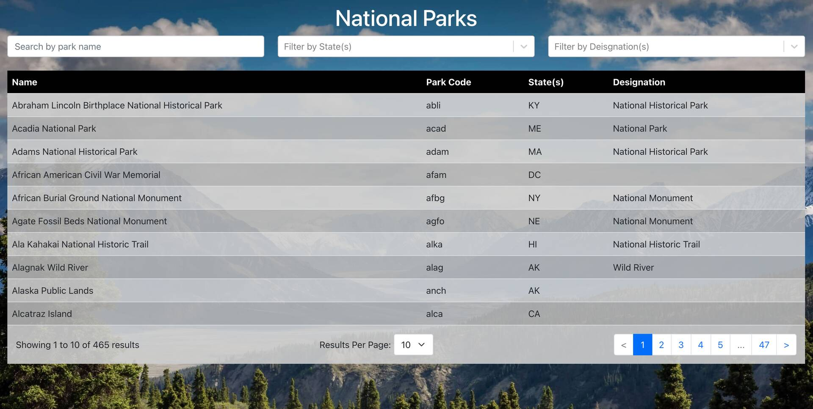
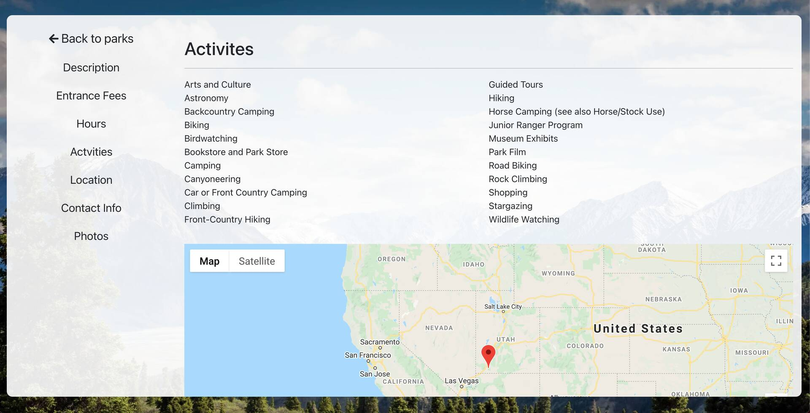

# Outdoor Adventures

## Description

I am an active person and always enjoyed spending time outdoors. I designed this application to help search through and find detailed information on all the national parks in the United States.

While building this project, I was able to incorporate a lot of different programming concepts that I wanted to explore. This project features server side pagination, redux state management and using library styled components to handle all css styling and complying. It is a fully stack application that is completly responsive.

### View the Project Live  

https://outdoor-adventures1.netlify.app/

#### Built With

- Redux (using [Redux Toolkit](https://redux-toolkit.js.org/))
- [Styled Components](https://styled-components.com/)
- React.js
- Node.js (Express framework)
- MySQL
- Bootstrap
- [React Google Maps](https://www.npmjs.com/package/@react-google-maps/api)
- National Parks API

## Technical Overview

#### Server Side Pagination

One of the key features of this project is that the main park page features server side pagination and search filitering. I have a lot of experience with doing pagination and filtering on the front end only, but this gave me the oppourtunity to do that same functionality on the backend. This is useful in business applications because most businesses are working with very large data sets. Thus, the structure of this project could be easily scaled to work with a much larger set of data without effecting the user experience.

#### Redux

I used redux as a tool to help simplify my application. This allow me to send data to child components within the application without have to prop drill down to them and kept the main app component much more readiable.

#### Styled Components

I am familar with using css to style my components, but I wanted to try out styled componets as a way to combined my styling into the componets them selves (without having to have extra css files for styling). After building this project, I really enjoy using styled components. It is very straight forward and offers lots of advantages over simply using plain css for styled your components such as descresing file sizes, allow you to more easily work with variables in your application, and keeping your styling in the same file as your react component. Since it generates unique classnames, you won't have to worry about accidentally styling something in a large application.

#### No Down time

With this application, I handled all asynchronous tasks with loading screens so the user is always engaged with the page. It makes the app appear to work faster and looks more professional.

## Usage

#### Park Search

- This page has a table with all the national parks in the United States. You can search for a specific national park along with using search filters by state and park designation.

#### Park Info Page

- Has detailed information on the park you selected including a description, entrance fees, park hours, activites, location, contact info, and images from that park.

## Backend

[Backend Github Page](https://github.com/Mark-Mulligan/outdoor-adventures-backend-v1.0)

## Contact

[My Github](https://github.com/Mark-Mulligan) || mark.mulligan.jr1@gmail.com

#### How to Contact Me

Feel free to reach out to me if you have any questions about this project. You can email me using the email listed above or can go to my github page to view my other projects and portfolio.

© Mark Mulligan 2021 All Rights Reserved.
